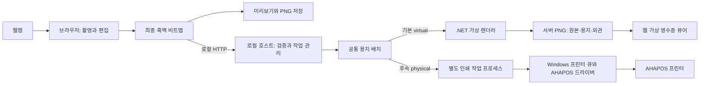

# YS Fourcut — 서비스 구현 설계

상태: 구현 지시용 설계, 앱 구현·실물 인쇄는 아직 수행하지 않음.
갱신일: 2026-08-31. 사용자 확인 사항: 프린터 브랜드는 **AHAPOS**.

## 1. 이번에 정한 구현 방식

**한 대의 PC에서 실행하는 로컬 포토부스 웹앱**으로 만든다. 사용자는 실행 파일을 열고 브라우저에서 사진을 찍는다. 우선 같은 PC의 .NET 프로그램이 흑백 네컷을 받아 실제 용지 치수와 외관의 **가상 영수증 PNG**를 만들고 웹에 돌려준다. 프린터가 준비되면 같은 접수 API 아래에 AHAPOS 실물 어댑터를 연결한다.

현재 우선 납품은 프린터 없는 가상 버전이다. 기존 프로그램 비교, 재사용 라이브러리, 서버 렌더링 세부 계약은 [VIRTUAL_PRINTER_DESIGN.md](VIRTUAL_PRINTER_DESIGN.md)를 따른다. 이 문서의 GDI 항목은 후속 실물 연동 설계다.

**개발 환경은 WSL로 확정됐다.** Vite와 Linux .NET 가상 호스트는 WSL에, 브라우저와 실제 웹캠은 Windows에 둔다. 준비 상태와 실행 절차는 [WSL_DEVELOPMENT.md](WSL_DEVELOPMENT.md)를 따른다. 아래 Windows 설치 형태는 후속 배포 형태이며 개발 도구까지 Windows로 옮기라는 뜻이 아니다.

| 결정 | 이번 구현의 기본안 |
| --- | --- |
| 운영 환경 | 우선 Windows 11 + Chrome/Edge + 웹캠. 가상 버전은 프린터 불필요. 운영 OS는 설계 가정 |
| 현재 개발 | WSL의 Vite + Linux .NET 10, Windows 브라우저/웹캠, 개발 소스는 Linux 파일시스템 |
| 화면 | React + TypeScript + Vite, 한국어 터치 UI |
| 촬영·합성 | 브라우저의 카메라 API와 Canvas, 사진 처리용 Web Worker |
| 로컬 프로그램 | C# / .NET 10 / ASP.NET Core Minimal API |
| 기본 실행 | `virtual`: .NET이 content/paper/appearance PNG를 만들고 웹에서 조회 |
| 렌더러 재사용 | `CrossEscPos.Rendering.Skia` + `CrossEscPos.Abstractions` 1.2.0, 얇은 용지/외관 합성 계층 |
| 후속 실물 인쇄 | `physical`: Windows에 등록된 AHAPOS 프린터 큐에 GDI로 비트맵 인쇄, 장치 검수 후 활성화 |
| 웹 주소 | 운영 시 `http://127.0.0.1:4317`, 화면과 API를 같은 프로그램에서 제공 |
| 설치 형태 | Windows x64용 런타임 포함 폴더 배포, 실행 파일 하나로 시작 |
| 저장소 | 클라우드·사진 DB 없음. 설정/사진 없는 작업 기록만 로컬 파일. 가상 PNG는 제한된 메모리 임시 보관 |
| 인터넷 | 최초 설치·개발 이후 촬영/출력에는 불필요. 폰트·아이콘·스크립트도 로컬 포함 |
| 직접 USB/직렬 인쇄 | 첫 기본안에서 제외. 기존 코드나 모델 검증으로 필요성이 확인되면 어댑터만 교체 |

.NET 10은 작성일 기준 지원 중인 LTS 계열이므로 기본 런타임으로 선정한다. 실제 구현 때 최신 지원 패치를 고정한다. [Microsoft 지원 정책](https://dotnet.microsoft.com/en-us/platform/support/policy/dotnet-core)

이는 AHAPOS라는 브랜드가 특정 프로토콜을 보장한다는 뜻이 아니다. 정확한 모델과 기존 출력 방식이 확인되면 인쇄 어댑터를 조정한다. 운영 PC가 Windows가 아닌 것으로 확인되면 이 가정을 먼저 수정하고, 다른 OS 지원까지 한꺼번에 만들지는 않는다.

## 2. 이 구조를 선택한 이유

- 화면·카메라·사진 편집은 웹 기술로 구현하기 쉽고, 출력은 운영체제 프린터 기능을 쓸 수 있다.
- 지금은 OS 프린터 없이 실제 웹 → .NET 접수·이미지 생성·조회·오류 복구를 끝까지 시험할 수 있다. 가상 출력에도 실물과 같은 최종 비트맵과 작업 관리 계약을 사용한다.
- 설치된 AHAPOS 드라이버로 인쇄할 수 있다면 브라우저 USB 호환성이나 장치 드라이버 교체에 의존하지 않는다.
- 촬영 중에는 인쇄 프로그램과 통신하지 않아도 된다. 인쇄 오류가 나도 사진 편집과 PNG 저장은 유지된다.
- 화면과 API를 같은 로컬 주소로 제공하므로 외부 사이트에서 로컬 인쇄 서비스에 접근하는 구조를 만들 필요가 없다.
- GDI 인쇄가 해당 모델에서 맞지 않거나 기존 직접 전송 코드가 더 적합하면, 최종 비트맵을 받는 경계 아래만 바꾼다.

브라우저의 `window.print()`와 별도 인쇄 대화상자는 기본 사용자 흐름에 넣지 않는다. 그렇다고 Windows 드라이버가 정확한 사진 출력·용지 길이·커팅을 보장한다고 가정하지도 않는다. 작은 이미지로 먼저 검증한다.

## 3. 실행 구조



| 부분 | 맡는 일 | 맡지 않는 일 |
| --- | --- | --- |
| 웹앱 | 카메라, 4컷 상태, 크롭, 명암, 디더링, 한글 합성, 미리보기 | USB endpoint 탐색, 프린터 명령 생성 |
| 로컬 호스트 | 웹 파일 제공, 세션 인증, 프로필, 입력 검증, 중복 방지, 상태/결과 이미지 조회 | 사진 재보정, 클라우드 업로드 |
| 가상 렌더러 | 1비트 복원, dot 치수 배치, .NET에서 용지·그림자·절취 외관 렌더링 | 사진 재디더링, OS 인쇄, AHAPOS 호환성 확정 |
| 실물 인쇄 작업 프로세스 | 승인된 프로필로 비트맵 출력, spool job ID와 결과 보고 | 임의 파일 읽기, 셸 명령 실행, 실패 시 자동 재인쇄 |
| 프린터 드라이버 | 실제 장치가 이해하는 형태로 출력 | 서비스 차원의 중복 요청 방지 |

호스트가 빌드된 웹 자산을 `wwwroot`에서 제공한다. 서버 프로젝트·설정·작업 기록은 웹 루트 밖에 둔다. [ASP.NET Core 정적 파일 문서](https://learn.microsoft.com/en-us/aspnet/core/fundamentals/static-files?view=aspnetcore-10.0)

WSL을 기본 개발 장소로 사용한다. 가상 API와 렌더 worker도 Linux에서 실행하며 Windows 브라우저가 루프백으로 접속한다. **후속 GDI 실물 출력 호스트와 인쇄 작업 프로세스는 Windows에서 실행**한다. Windows 프린터가 WSL에서도 자동으로 보인다고 가정하지 않는다.

## 4. 사용자가 실제로 거치는 흐름

### 지금: 프린터 없는 첫 실행

1. WSL 개발에서는 `npm run dev`로 Vite와 Linux .NET 가상 호스트를 시작하고 Windows 브라우저에서 접속한다. Windows 배포 뒤에는 `YsFourcut.Host.exe --printer-mode virtual`을 사용한다. 이 명령들은 구현할 계약이며 현재 실행 파일이 존재한다는 뜻은 아니다.
2. 웹캠 또는 샘플 이미지와 `가상 80mm` 프리셋을 선택한다. 실제 프린터 큐나 드라이버를 요구하지 않는다.
3. 작은 패턴을 웹에서 .NET으로 보내 서버 PNG가 생성되는지 확인한다.
4. 촬영 → 편집 → `가상 출력` → 용지 외관/원본 비교 → 저장/다음 촬영을 사용한다.
5. 가상 상태를 항상 표시한다. .NET이 중지되면 출력 실패를 표시하며 프런트 이미지만으로 성공 화면을 만들지 않는다.

### 나중: 실제 프린터를 연결할 때 운영자

1. 기존 AHAPOS 드라이버와 Windows 테스트 페이지 출력을 확인한다. 없는 드라이버를 임의 사이트에서 받아 자동 설치하지 않는다.
2. `YsFourcut.Host.exe`를 실행하고 처음 설정 화면을 연다.
3. 실제 AHAPOS 프린터 큐와 웹캠을 선택한다. 브랜드 문자열이나 Windows 기본 프린터만 보고 자동 선택하지 않는다.
4. 드라이버가 알려 주는 인쇄 폭·해상도·용지 설정을 읽고, 작은 패턴으로 후보 설정을 확인한다.
5. 네컷 샘플까지 출력한 뒤 폭·방향·사진 디테일·하단·절취를 확인하여 프로필을 검증 상태로 저장한다.
6. 방문자 촬영 화면으로 전환한다. 다음 실행부터는 검증된 설정을 불러온다.

설정 화면은 운영 편의를 위한 화면 분리이며, 이것만으로 별도 관리자 인증이 생긴다고 표현하지 않는다. 공용 PC에서 설정 접근을 잠그는 PIN 기능은 필요 시 후속으로 추가한다.

### 방문자 한 명의 촬영

| 화면 | 구체적인 동작 |
| --- | --- |
| 시작 | 큰 `촬영 시작` 버튼, 카메라 준비 상태, 인쇄 가능 여부 |
| 촬영 | 카메라와 동일 크롭/반전의 미리보기, `1 / 4` 표시, 컷마다 3초 카운트다운 |
| 촬영 완료 | 각 슬롯에 썸네일 표시. 네 컷 뒤 자동으로 결과 편집 화면으로 이동 |
| 편집 | 네컷 스트립, 한 컷 다시 찍기, 프레임 2종, 밝기/대비, 짧은 문구 |
| 인쇄 | 최종 미리보기 확인 후 기본 `가상 출력`, 실물 모드에서만 `한 장 인쇄`. 전송 중 연타와 설정 변경 방지 |
| 결과 | 기본은 서버가 만든 용지 외관·치수와 원본 보기. 실물 모드는 큐 전달 안내. 재출력·PNG 저장·다음 촬영 제공 |

한 컷 재촬영도 3초 카운트다운을 거치고 해당 슬롯만 교체한다. 프린터가 없어도 촬영·편집·저장은 가능하다. 촬영 데이터는 다음 촬영 또는 유휴 만료 시 정리한다. 기본 유휴 시간은 120초이며, 인쇄가 끝나지 않았거나 결과가 불명확한 동안에는 자동 초기화하지 않는다.

## 5. 사진 처리와 결과물 크기

브라우저는 네 장 원본을 메모리에 유지한다. 촬영 시점과 슬롯 ID를 고정하고, 캡처 결과와 편집 설정에 revision을 부여하여 늦게 끝난 합성이 최신 결과를 덮어쓰지 않게 한다.

처리 순서는 `원본 → 반전/크롭 → 목표 dot 크기 → 밝기·대비 → 그레이스케일 → 사진 영역 디더링 → 흰 배경/프레임/한글 합성 → 최종 1비트 이미지`다. 글자의 안티앨리어싱 결과도 마지막에 흑백으로 확정한다. 미리보기와 PNG는 이 최종 이미지에서 생성한다.

- 기본 디더링은 Floyd–Steinberg, 비교용으로 ordered dithering 한 가지를 제공한다.
- 합성은 설정 변경 후 150ms 정도 묶어서 실행하고, 이전 작업의 결과는 버린다.
- Worker에는 필요한 이미지 픽셀만 전달한다. DOM과 폰트에 의존하는 글자 렌더링은 메인 스레드에서 완료한 뒤 결합한다.
- 날짜는 촬영 세션 시작 시 고정한다. 재인쇄할 때 현재 날짜로 바뀌지 않는다.
- 한글 폰트는 재배포 가능한 파일을 라이선스와 함께 로컬 포함하고 로딩 완료 후 사용한다.

### 계산 예시 — 실제 AHAPOS 사양이 아님

가상 개발 프로필을 `인쇄 폭 576dot, 203.2DPI = 8dot/mm`로 놓았을 때의 예시다. AHAPOS 사양으로 검증한 값이 아니다.

| 요소 | 값 |
| --- | --- |
| 최종 이미지 폭 | 576dot |
| 이미지 내부 좌우 여백 | 각 24dot. 용지의 인쇄 불가 여백과 별개 |
| 각 사진 | 528 × 396dot, 4:3 |
| 사진 사이 간격 | 12dot × 3 |
| 헤더 / 푸터 | 64dot / 104dot |
| 총 이미지 높이 | `64 + 396 × 4 + 12 × 3 + 104 = 1788dot` |
| 계산상 이미지 길이 | 223.5mm. 용지 길이는 앞뒤 빈 이송 영역을 더함 |
| 1비트 픽셀 데이터 | 행당 72byte × 1788행 = 128,736byte |

가상 80mm 프로필은 전체 폭 640dot, 좌우 인쇄 불가 여백 각 32dot, 앞 24dot/뒤 64dot를 더한다. 따라서 위 예시의 `paper.png`는 **640 × 1876pixel, 80 × 234.5mm**, 본문 원점은 `(32, 24)`다. `appearance.png`의 바깥 그림자 공간은 물리 용지 치수에 포함하지 않는다.

실제 프로필에서는 인쇄 가능 영역과 X/Y 해상도로 다시 계산한다. 용지 폭과 인쇄 가능 폭을 구분하고, 잘못된 드라이버 설정을 맞추려고 이미지를 자동 확대/축소하지 않는다. 공통 `ReceiptLayout`을 사용하되 가상 출력으로 드라이버 좌표·농도·커팅까지 검증했다고 주장하지 않는다.

## 6. 후속 실물 인쇄 경로: Windows GDI

### 먼저 확인할 조건

- 운영 PC에서 해당 AHAPOS 프린터의 Windows 테스트 페이지가 출력되는가?
- 드라이버가 비트맵 출력과 필요한 사용자 지정 용지 길이를 지원하는가?
- 반환된 인쇄 가능 폭·DPI가 실물 결과와 일치하는가?
- 드라이버의 페이지 종료 시 이송·커팅 동작이 네컷에 적합한가?

하나라도 미확인이면 방문자 **실물** 인쇄는 비활성화하고 운영자 테스트만 허용한다. 가상 출력은 계속 사용할 수 있다. GDI 후보를 선택했다고 브랜드 전체의 호환성을 확인한 것은 아니다.

### 구현 계약

1. 저장한 프린터 큐를 정확히 지정하고, 큐가 없어졌으면 다른 기본 프린터로 대체하지 않는다.
2. 승인된 설정을 바탕으로 작업별 `DEVMODE`를 구성한다. 한 스트립을 **한 페이지, 한 작업, 한 부**로 만든다.
3. 해당 설정의 프린터 DC에서 `GetDeviceCaps`로 인쇄 영역·DPI·물리 여백을 확인한다. 데이터와 맞지 않으면 인쇄 시작 전에 실패시킨다. [Microsoft 장치 정보 API](https://learn.microsoft.com/en-us/windows/win32/api/wingdi/nf-wingdi-getdevicecaps)
4. 웹에서 받은 1비트 행 데이터를 GDI용 DIB로 변환한다. 입력 행은 byte 단위로 촘촘하지만 DIB 행은 DWORD 정렬이므로 별도 stride로 재패킹한다. 팔레트는 0=흰색, 1=검정으로 맞추고 상하 방향을 고정한다. [Microsoft DIB 출력 API](https://learn.microsoft.com/en-us/windows/win32/api/wingdi/nf-wingdi-setdibitstodevice)
5. `StartDocW → StartPage → SetDIBitsToDevice → EndPage → EndDoc` 순서로 인쇄한다. 문서명은 사진 문구 대신 `YSF:<작업 UUID>`만 사용한다. `StartDocW`가 반환하는 spool job ID를 즉시 호스트에 보고한다. [Microsoft StartDocW](https://learn.microsoft.com/en-us/windows/win32/api/wingdi/nf-wingdi-startdocw)
6. 픽셀 크기와 출력 좌표를 장치 dot 기준으로 맞추고 자동 맞춤, OS 화면 배율, A4 기본 용지, 추가 여백이 개입하지 않게 한다. 물리적으로 출력할 수 없는 영역은 이미지 배치에 포함하지 않는다.
7. 이송/커팅은 검증된 드라이버 설정 한 곳에서 처리한다. 같은 작업 뒤에 별도 ESC/POS 커팅 명령을 덧붙이지 않는다.

종이 길이의 드라이버 단위와 이미지 dot 단위를 분리한다. 이미지 높이를 출력 가능한 한 페이지에 담지 못하면 여러 A4 페이지로 나누는 대신 `PAGE_SIZE_UNSUPPORTED`로 실패한다. 넉넉한 용지 길이를 설정하고 넘치는 백지를 자동으로 잘라 주리라 기대하지 않는다.

GDI/스풀러 호출은 오래 멈출 수 있으므로 HTTP 요청 처리 스레드에서 직접 실행하지 않는다. 같은 실행 파일의 `--print-worker` 모드를 별도 숨김 프로세스로 실행하고, 표준 입출력 파이프로 제한된 작업 데이터와 상태만 주고받는다. 60초 무응답은 앱의 감시 기준이며, 작업 취소나 미출력을 보장하는 시간 제한이 아니다.

드라이버가 추가로 래스터를 변환할 수 있어 GDI 경로는 프린터가 받는 최종 바이트와 브라우저 비트맵의 동일성을 보장하지 않는다. 배치·폭·명암·디테일을 실물로 검수한다.

## 7. 직접 전송이 필요한 경우의 경로

GDI로 정확한 폭·길이·농도를 맞출 수 없거나 예전 코드가 검증된 직접 전송 경로를 사용한다면, 프린터 어댑터만 변경한다. 이는 **설정/검증 단계의 선택**이며, 실패한 인쇄 작업을 다른 방식으로 자동 재시도하는 기능이 아니다.

| 확인된 근거 | 사용할 수 있는 어댑터 |
| --- | --- |
| Windows 큐가 RAW 데이터를 받고 모델의 ESC/POS 이미지 명령이 확인됨 | `WindowsRawEscPosPrinter` |
| 기존 코드에서 실제 COM 포트·속도·명령이 확인됨 | `SerialEscPosPrinter` |
| 기존 SDK/로컬 서비스가 이미지 인쇄를 지원함 | 해당 계약을 감싼 어댑터 |
| 다른 운영 OS 또는 기존 브라우저 직접 연결이 반드시 필요함 | 변경 이유를 기록하고 호스트/전송 경계만 재설계 |

RAW 경로에서는 **PNG 파일을 그대로 WritePrinter에 넣지 않는다.** 프린터가 해석할 수 있는 이미지 명령과 데이터로 인코딩한다. Windows RAW 전달은 이미지 형식 변환 기능이 아니다. [Microsoft RAW 인쇄 조건](https://learn.microsoft.com/en-us/windows/win32/printdocs/writeprinter)

GDI의 DWORD 행 정렬과 ESC/POS의 byte 행 길이를 혼용하지 않는다. `GS v 0`, 전송 분할 크기, 이송, 커팅은 모델별로 확인된 값만 사용한다. **지금은 가상 렌더러**, 다음은 GDI 후보 순으로 진행하며 대체 경로는 확인된 필요가 있을 때 하나만 구현한다. 가상 PNG 생성을 위해 ESC/POS 전송을 새로 만들지 않는다.

## 8. 웹앱과 로컬 프로그램의 API

운영 시 모두 동일 origin의 `/api` 아래다. 상태 변경은 POST/PUT으로만 하며 GET으로 인쇄하지 않는다. 공개 웹사이트용 API가 아니다.

| 요청 | 역할 |
| --- | --- |
| `POST /api/bootstrap` | 실행기가 만든 일회용 코드 교환, 로컬 세션 쿠키 발급 |
| `GET /api/health` | 버전, host instance ID, printerMode `virtual`/`physical`, 준비 상태 |
| `GET /api/printers` | virtual에서는 가상 프리셋만 반환하고 OS 큐 미조회. physical에서는 등록 큐 목록 |
| `GET /api/printer-profile` | 현재 프로필과 revision, 검증 여부 |
| `PUT /api/printer-profile` | 큐와 출력 설정 저장; 인쇄 핵심 설정 변경 시 검증 해제 |
| `POST /api/printer-tests` | 지정 후보 프로필로 작은 패턴 또는 네컷 샘플 인쇄; 동일 작업 관리자 사용 |
| `POST /api/printer-profile/verify` | 현재 revision의 테스트 작업 ID와 운영자 확인 결과로 검증 기록 |
| `POST /api/print-jobs` | 최종 비트맵 한 장을 검증 후 접수 |
| `GET /api/print-jobs/{clientJobId}` | 모드, 상태, 레이아웃, 결과 이미지 경로/만료 또는 spool job ID 조회 |
| `GET /api/print-jobs/{clientJobId}/artifacts/{kind}` | 인증된 세션의 content/paper/appearance PNG 조회; 재렌더링하지 않음 |
| `POST /api/session/artifacts/clear` | 현재 인증 세션의 완료 결과 이미지 삭제; 진행 중이면 409 |
| `PUT /api/virtual-printer/fault` | virtual에서만 다음 작업에 적용할 일회성 오류/지연 선택 |
| `POST /api/print-jobs/{clientJobId}/resolve` | 종이/Windows 큐를 확인한 운영자의 불명확 상태 정리; 재인쇄하지 않음 |

### 인쇄 요청 데이터

| 필드 | 계약 |
| --- | --- |
| `schemaVersion` | `1` |
| `clientJobId` | 클릭 한 번에 생성하는 UUID. 통신 오류가 나도 같은 요청은 ID를 유지 |
| `profileId`, `profileRevision` | 서버 프로필과 정확히 일치. virtual은 범위/스키마 검사, hardware는 실물 검수까지 필요 |
| `bitmap.widthDots`, `heightDots` | 양의 정수; 프로필과 크기 제한 검사 |
| `bitmap.strideBytes` | `ceil(widthDots / 8)` |
| `bitmap.bitOrder`, `blackBit` | `msb-first`, `1` |
| `bitmap.dataBase64` | 위에서 아래, 왼쪽부터, 행 우측 남는 비트는 흰색 0 |

클라이언트가 프린터 큐 이름, OS 파일 경로, 셸 명령, 커팅 바이트, 임의 RAW 명령을 제출하지 못하게 한다. 인쇄 부수는 서버에서 1로 고정한다.

요청 본문 상한은 1MiB, 이미지 상한은 1024 × 4096dot 및 512KiB의 해제된 1비트 데이터로 시작한다. 여기에 실제 프로필의 최대 폭·페이지 높이·용지 길이 제한을 더 적용한다. base64 오류, 정확하지 않은 데이터 길이, 검정 패딩 비트도 거부한다. 이 상한은 서비스 안전 기본값이지 AHAPOS의 장치 사양이 아니다.

접수 성공은 `202`와 작업 ID/상태를 반환한다. 웹앱은 약 1초 간격으로 상태를 조회한다. 같은 ID와 같은 내용은 기존 작업을 반환하고, 같은 ID에 다른 비트맵/프로필이면 `409 JOB_ID_CONFLICT`다. 중복 조회/재요청이 두 번째 인쇄를 만들지 않게 한다.

그 외에는 `PRINTER_BUSY`, `PROFILE_UNVERIFIED`, `PROFILE_CHANGED`, `PRINTER_NOT_FOUND`, `INVALID_BITMAP`, `PAGE_SIZE_UNSUPPORTED`, `PRINT_OUTCOME_UNKNOWN` 같은 구조화된 오류 코드를 사용한다. UI는 코드별 한국어 안내를 제공하고 원본 사진·비트맵·인증값은 오류 로그에서 제외한다.

## 9. 중복 인쇄와 상태 관리

서비스 전체에서 진행 중인 작업은 하나만 허용한다. UI의 disabled 상태와 별개로 서버에서도 원자적으로 잠근다. 가상 프린터도 같은 작업 ID·프로필 revision·잠금을 사용한다. 렌더러와 실물 어댑터가 서로 자동 대체되지 않게 서버 모드를 고정한다.

| 상태 | 의미 | 사용자 안내 |
| --- | --- | --- |
| `accepted` | 검증과 작업 등록 완료, 아직 렌더링/OS 호출 전 | 출력 준비 중 |
| `rendering` | virtual: .NET이 결과 PNG 생성 중 | 가상 영수증을 만드는 중 |
| `rendered` | virtual: 서버 PNG 생성 완료. `isPhysical=false`, spool ID 없음 | 가상 영수증을 만들었어요 |
| `virtual_failed` | virtual: 렌더링 실패 또는 주입된 가상 오류 | 가상 출력에 실패했어요 |
| `submitting` | 인쇄 작업 프로세스가 OS 호출을 시작함 | 프린터로 보내는 중 |
| `submitted` | OS 큐에 작업 전달 완료; 종이 결과는 확정하지 못함 | 프린터 큐에 전달했어요. 종이를 확인해 주세요 |
| `failed_before_submit` | OS 인쇄를 시작하지 않았음을 확인한 실패 | 설정을 확인한 뒤 다시 시도해 주세요 |
| `outcome_unknown` | OS 호출 이후 오류·시간 초과·프로세스 중단·추적 불가 | 일부 또는 전부 출력되었을 수 있어요. 종이와 큐를 확인해 주세요 |

가상 출력의 세부 응답·오류·메모리 수명은 `VIRTUAL_PRINTER_DESIGN.md`를 따른다. 가상 렌더 작업 종료와 늦은 콜백 무효화를 확인한 후 잠금을 해제하며 terminal 상태의 `queueBusy=false`다. 부분 이미지가 있더라도 `complete=false`이고 성공으로 표시하지 않는다. 가상 실패에 실제 용지/OS 큐 확인을 요구하지 않는다.

실물 작업 레코드에는 위 상태와 별도로 `queueBusy`/관찰 가능한 큐 상태를 둔다. `submitted`로 HTTP 전송이 끝나도 해당 작업이 큐에 남아 있으면 다음 작업과 새 세션 시작을 막는다. 큐에서 사라진 것을 종이 출력 성공으로 단정하지 않는다. 추적이 불가능하면 자동 잠금 해제 대신 확인이 필요한 상태로 전환한다.

`clientJobId`, 요청 digest, profile revision, 상태, spool job ID, 시각만 작은 로컬 작업 기록으로 남긴다. 파일 저장 실패 시 인쇄를 시작하지 않는다. OS 호출 전에 기록하고, 결과를 원자적으로 갱신하여 재시작 후 중복 접수를 막는다. 완료 레코드는 24시간 유지한 뒤 정리하고, 해결되지 않은 레코드는 자동 삭제하지 않는다. 기록 쓰기와 OS 인쇄 사이에는 원자적 트랜잭션이 없으므로 **정확히 한 번의 물리적 출력을 보장한다고 주장하지 않는다.**

`resolve`는 재출력 명령이 아니다. 관련 인쇄 작업 프로세스가 종료됐고, 운영자가 종이 및 해당 OS 작업의 잔여 여부를 확인한 뒤에만 잠금을 해제한다. 작업 프로세스를 종료해도 이미 스풀된 인쇄를 되돌릴 수 없다는 안내를 유지한다.

프로그램 재시작 시 미완료 작업을 자동 복원·재인쇄하지 않는다. 실물은 작업 ID로 큐를 확인하고 불명확하면 운영자 확인을 요구한다. 앱이 재전송하지 않아도 Windows 큐의 기존 작업이 프린터 복구 뒤 출력될 수 있다. 전체 프린터 큐나 타 프로그램 작업을 지우는 기능은 만들지 않는다. 가상 작업은 남은 렌더 프로세스 종료를 확인하고 미완료 건을 `virtual_failed`로 정리한다. 과거 `rendered` 기록의 메모리 PNG는 재시작 후 없으므로 `available=false`로 표시하며 자동 복원하지 않는다.

브라우저에서 응답이 끊겨도 새 작업 ID로 재전송하지 않는다. 기존 ID 조회부터 한다. 사용자가 `다시 인쇄`를 명시적으로 누르면 중복 가능성 안내 후 **새 작업 ID**로 한 장을 접수한다.

## 10. 사진 보관과 로컬 보안

- 원본 네 장은 브라우저 메모리에만 둔다. 최종 1비트 이미지 하나만 같은 PC의 로컬 호스트와 인쇄 작업 프로세스로 전달한다.
- 앱은 사진 파일·base64·문구를 디스크나 로그에 기록하지 않는다. 처리용 픽셀 참조는 제출/인코딩 종료 뒤 해제한다. 예외적으로 가상 결과 PNG만 메모리에 생성 시점부터 10분, 세션당 완료 3건/64MiB, 건당 합계 32MiB 이내 보관한다. 다음 촬영에서 삭제하고 타이머로 만료시킨다. 메모리의 즉시 보안 삭제까지 보장하지는 않는다.
- **Windows 스풀러와 드라이버는 임시 출력 데이터를 디스크에 저장할 수 있다.** 따라서 시스템 전체에서 사진이 절대 디스크에 남지 않는다고 설명하지 않는다. `인쇄한 문서 보관` 설정과 잔여 작업 확인 방법을 운영 문서에 안내하되, OS 설정을 자동 변경하지 않는다.
- 가상 PNG는 조회용 메모리 결과로 만들며 디스크 다운로드는 사용자가 저장을 누를 때만 한다. 사진을 localStorage/IndexedDB에 자동 보관하거나 외부 분석 서비스에 보내지 않는다. 가상 모드에서는 스풀러를 호출하지 않지만 OS swap/crash dump까지 통제한다고 주장하지 않는다.
- 호스트는 `127.0.0.1`에만 바인딩하고 허용 Host를 확인한다. 포트 충돌 시 다른 프로세스를 종료하거나 외부 주소로 바인딩하지 않는다.
- 실행기가 256비트 난수의 일회용 코드를 URL fragment로 브라우저에 전달한다. 웹앱은 주소에서 즉시 제거하고 `/api/bootstrap`으로 교환한다. 코드는 60초 내 한 번만 사용하며 로그에 남기지 않는다.
- 세션은 호스트 프로세스 수명 안에서만 유효한 HttpOnly/SameSite=Strict 쿠키로 유지한다. 기본 루프백 HTTP에서는 Secure 속성에 의존하지 않고, HTTP 허용을 루프백에만 한정한다. LAN/외부 공개로 바꾸는 것은 별도 HTTPS·인증 설계가 필요한 범위 변경이다. [쿠키 속성 참고](https://developer.mozilla.org/en-US/docs/Web/HTTP/Reference/Headers/Set-Cookie)
- 일회용 코드 교환을 제외한 API는 유효 세션과 정해진 요청 헤더를 확인하고, 모든 변경 요청에는 정확한 Origin과 JSON Content-Type을 요구한다. CORS `*`를 사용하지 않는다. 교차 출처의 읽기도 허용하지 않는다.
- 사진·토큰·작업 응답은 `no-store`, 로컬 자산만 캐시 가능하게 한다. 외부 스크립트·CDN 폰트를 쓰지 않고 로컬 PC 계정의 신뢰 범위를 넘는 접근 제어를 주장하지 않는다.
- 결과 PNG에도 세션·요청 헤더 검사를 적용한다. 웹은 fetch로 받아 Blob URL로 표시하고 초기화 시 해제한다. 인증 없는 img URL이나 `wwwroot/results` 폴더는 만들지 않는다. 세션 초기화와 다음 작업 사이의 잠금 확인 절차는 가상 설계서를 따른다.

## 11. 폴더와 실행 명령

아래는 생성할 구조와 명령의 계약이다. 지금 존재하거나 실행 검증을 마친 명령이 아니다.

```text
apps/web/                         # React/Vite 화면, 카메라, Worker, 미리보기
apps/print-host/                  # .NET 호스트 + --print-worker 진입점
  Api/                           # 위의 로컬 API
  Jobs/                          # 잠금, 중복 방지, 상태, 작업 기록
  Profiles/                      # kind=virtual 프리셋과 후속 hardware 설정
  Printing/                      # 공통 IPrinterBackend; MockPrinter는 단위 테스트 전용
  Printing/Virtual/              # 기본 VirtualReceiptPrinter
  Rendering/                     # 공통 ReceiptLayout, Skia 재사용, 용지/외관 생성
  Artifacts/                     # 인증 세션별 메모리 PNG, TTL/용량 제한
  Printing/Windows/              # 후속 Win32/GDI/DIB/spool, 현재 없어도 가상 버전 완료 가능
  wwwroot/                       # 웹 빌드 결과, 출력 데이터 저장 금지
packages/imaging/                 # 브라우저용 순수 TS 사진/레이아웃/1비트 함수
tests/print-host/                # .NET 계약·작업·픽셀·치수·보관 수명 테스트
tests/e2e/                       # 브라우저 + 실제 .NET virtual API 흐름
docs/PRINTER_REFERENCE.md         # 현재 확인된 AHAPOS 정보
docs/HARDWARE_CHECKLIST.md        # 구현 후 실물 검수 기록
scripts/                        # 개발/패키징용 스크립트
```

- JS는 npm 하나만 사용하고, 새 프로젝트에서 npm workspace와 루트 lockfile을 둔다.
- `npm run dev`: 프런트와 실제 .NET 가상 호스트를 함께 실행. Windows에서도 기본은 virtual이며 실물은 별도로 활성화한다.
- 개발용 Vite 주소는 `http://127.0.0.1:5173`, API는 WSL의 4317이다. 웹은 상대 `/api`만 사용하고 Vite가 전체 API를 프록시한다. 프록시는 Origin을 위장하지 않는다. 호스트는 개발에서만 5173 Origin을 정확히 허용하며 운영 빌드에는 이 예외를 남기지 않는다. 상세 쿠키/인증 계약은 WSL 가이드를 따른다.
- 호스트는 `net10.0`을 대상으로 하고 가상 실행에 Windows 전용 프레임워크를 요구하지 않는다. Win32 호출은 Windows 전용 경로 안에 제한한다. WSL에서 실제 가상 PNG 생성과 네이티브 의존성을 검증하되 Windows 실행 검증을 대체하지 않는다.
- `npm run build`, `npm run lint`, `npm run typecheck`, `npm test`, `dotnet test`, `npm run test:e2e`, `npm run package:win`을 실제로 구성하고 README에 결과를 기록한다.
- 운영 배포는 `win-x64` 런타임과 Skia 네이티브 파일 포함 폴더로 만들고, 웹 빌드를 `wwwroot`에 넣는다. 운영 PC에는 개발용 Node/.NET SDK가 필요 없게 한다. 가상 출력에는 프린터 드라이버가 필요 없고 실물 출력에만 필요하다.
- Windows의 프로필/사진 없는 기록은 `%LOCALAPPDATA%/YSFourcut/`에 둔다. Linux는 XDG config/state 경로 또는 `~/.config/YSFourcut` / `~/.local/state/YSFourcut`을 사용한다. 저장소·웹 루트·공유 폴더에 두지 않는다.
- 실행기는 같은 사용자 세션에서 중복 호스트를 띄우지 않고, 새 인쇄 작업 프로세스도 잠금 안에서 하나만 시작한다. 로그인 자동 시작·Windows 서비스 등록·방화벽 변경은 기본 설치에서 하지 않는다.

## 12. Claude Code가 구현할 순서

아래는 설계 흐름 요약이다. 실제 실행은 `TASKS.md`의 01~14를 한 작업씩 진행한다. 이 문서 전체를 읽고 모든 단계를 한 세션에서 실행하지 않는다. 작업별 모델·범위·참고 절은 각 `tasks/NN.md`가 지정한다.

| 순서 | 결과물 | 통과 기준 |
| --- | --- | --- |
| 1 | 기존 Skia 렌더링 패키지 + Linux .NET 가상 호스트 | WSL에서 실제 패키지 복원과 PNG 생성, 프린터 없이 공통 API 한 장 접수 |
| 2 | 원본·용지·외관 PNG + 웹 뷰어 | 본문 픽셀 일치, mm/dot 치수, 여백·질감·절취와 서버 결과 조회 검증 |
| 3 | 카메라 4컷과 재촬영 | 권한 오류·중복 캡처·취소·반전/크롭 테스트 통과 |
| 4 | 인쇄 dot 합성과 최종 비트맵 | 고정 샘플의 배치·1비트·서버 PNG 복원 계약 통과 |
| 5 | 가상 전체 흐름과 오류 복구 | 동일 ID/지연/부분 실패/응답 유실/재시작, 서버 중단 실패, 결과 만료·초기화 검증 |
| 6 | WSL 개발 검수와 Windows 패키징 | WSL .NET + Windows 브라우저로 가상 출력. Windows 배포물은 publish와 Windows 실행 검증을 각각 보고 |
| 후속 | AHAPOS 큐 + GDI + 실물 검수 | 장치 준비 뒤 작은 패턴, 네컷 3회, 재연결, 이송/절취 확인. 현재 버전 완료를 막지 않음 |

GDI 경로의 필수 테스트는 DIB의 DWORD stride·팔레트·상하 방향·출력 영역이다. ESC/POS 인코딩 테스트는 그 대체 경로를 실제 구현할 때만 추가한다. 출력에 영향을 주는 driver/profile 변경은 검증 상태를 해제한다.

화면 시안만으로 완료하지 않는다. 다만 현재 요청은 **문서 구체화**이므로 이 문서 작성 단계에서 드라이버 설치, 앱 구현, 테스트 출력 또는 외부 배포를 실행하지 않는다.
