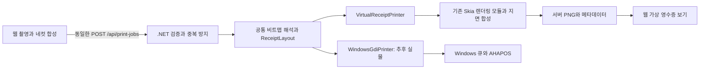

# 가상 영수증 프린터 — 구현 설계

갱신일: 2026-08-31. 현재 단계는 **설계 문서 작성**이며 앱·패키지 설치·실행 검증은 아직 하지 않았다.

## 1. 지금 먼저 완성할 프로그램

실물 AHAPOS가 준비되기 전에는 **가상 영수증 프린터가 기본 출력 장치**다. 웹에서 실제 인쇄와 같은 요청을 .NET에 보내면, .NET이 영수증 이미지를 렌더링하고 웹에서 그 결과를 받아 보여 준다. 브라우저가 자기 미리보기를 다시 보여 주거나 가짜 성공 응답만 반환하는 구현은 완료로 인정하지 않는다.

개발은 **WSL의 `npm run dev`로 Vite + Linux .NET 가상 호스트를 실행하고 Windows 브라우저로 접속**하는 방식이다. Windows 배포 후에는 `YsFourcut.Host.exe --printer-mode virtual`로 시작한다. 웹캠 촬영 또는 샘플 이미지 → 4컷 합성 → `가상으로 한 장 인쇄` → .NET 결과물 표시 → PNG 저장 → 다음 촬영까지 작동해야 한다. Windows 프린터 드라이버·장치 등록·실제 USB·상용 가상 프린터 설치가 없어도 실행된다. SDK·프록시·실물 전환은 `WSL_DEVELOPMENT.md`를 따른다.

실물 출력은 기존 `WindowsGdiPrinter` 설계를 유지하여 나중에 추가/검수한다. 화면과 `POST /api/print-jobs` 요청 형식은 그대로 두고 서버의 출력 장치만 바꾼다. 가상 출력 성공이 AHAPOS 드라이버·펌웨어·이송·커터 검증을 대신하지는 않는다.

## 2. 기존 프로그램과 라이브러리 재사용 결정

| 후보 | 확인한 기능 | 이번 사용 방식 |
| --- | --- | --- |
| CrossEscPosEmulator | .NET headless 렌더링, ESC/POS 해석, 이미지/이송/커팅 처리, PNG, 별도 데스크톱 앱 | **렌더링 라이브러리를 기본 경로에 채택**. 전체 에뮬레이터는 향후 명령 검증 도구로 활용 |
| SkiaSharp | .NET 2D 그래픽과 PNG 처리 | 위 라이브러리의 엔진을 그대로 쓰고 종이색·그림자·절취 외형 합성에도 사용 |
| ReceiptLine | 영수증용 텍스트 문서를 SVG 또는 프린터 명령으로 변환 | 상품표 중심 문서에 적합. 이미 완성된 네컷 비트맵을 다시 다른 문서 형식으로 만들 필요가 없어 기본에서는 제외 |
| POS Printer Emulator | Windows에서 RAW TCP 수신, 영수증 화면과 명령 확인. Trial/유료 라이선스 제공 | 외부 비교 도구 후보. 기본 실행의 설치·라이선스 의존성으로 넣지 않음 |

기능 확인 출처: [CrossEscPos 프로젝트](https://github.com/danielmeza/CrossEscPosEmulator), [SkiaSharp](https://github.com/mono/SkiaSharp), [ReceiptLine](https://github.com/receiptline/receiptline), [POS Printer Emulator 제작사](https://www.posprinteremulator.com/).

### 실제 채택할 패키지

- `CrossEscPos.Rendering.Skia` **1.2.0** 및 그 의존성 `CrossEscPos.Abstractions` **1.2.0**.
- NuGet의 1.2.0 메타데이터에서 .NET 10, MIT 라이선스, `SkiaSharp` / `SkiaSharp.NativeAssets.Linux` **3.119.4** 의존성을 확인했다. [NuGet 패키지](https://www.nuget.org/packages/CrossEscPos.Rendering.Skia/1.2.0)
- 배포 메타데이터의 소스 커밋은 `b81782566a0ec5a41f95cc2a065cc45fb5a3eafb`다. 조사 당시 main 커밋 `59da2d10b5c38d97487d1e7c68ca6afc6198f9e5`와 구분한다.
- 이미지 생성/Canvas/PNG는 공개된 `SkiaImageFactory`, `IReceiptImage`, `SkiaImageEncoder`를 재사용한다. 화려한 효과에만 같은 버전의 SkiaSharp API를 직접 사용한다.
- .NET 호스트에는 Avalonia UI, WASM, 에뮬레이터의 TCP/직렬/USB 모듈을 넣지 않는다. 최종 이미지 생성은 **서버 프로세스에서** 이루어진다.
- 기본 개발 호스트는 Linux의 `net10.0`이다. Windows 전용 TFM/System.Drawing을 끌어들이지 않고 Linux Skia 네이티브 파일의 실제 로드를 확인한다. 설치된 Windows .NET을 WSL용 SDK로 취급하지 않는다.
- 구현할 때 패키지와 네이티브 자산 버전을 lockfile로 함께 고정하고 복원·실행·취약점 점검을 한다. 임의로 SkiaSharp만 상위 주요 버전으로 바꾸지 않는다.
- 배포물에 실제 포함된 패키지·폰트 라이선스와 고지를 `THIRD_PARTY_NOTICES.md`로 제공한다. ImageSharp 백엔드로 자동 교체하지 않는다.

버전/메타데이터 및 소스를 확인했으며, 이 프로젝트에서 패키지 복원이나 렌더링 실행에 성공했다는 뜻은 아니다.

### 왜 완성된 에뮬레이터 전체를 그대로 붙이지 않는가

배포 커밋 소스에서 아래 동작을 확인했다. 우리에게 필요한 부분만 재사용하면 이를 피하면서 기존 그래픽 엔진을 활용할 수 있다.

| 확인 사항 | 적용할 원칙 |
| --- | --- |
| `PaperConfiguration`은 DPI/mm에서 픽셀을 계산하며 기본 출력 폭이 우리 프로필과 다름 | 라이브러리 기본 프로필을 쓰지 않고 앱이 명시한 정수 dot를 기준으로 지면 생성 |
| `Receipt.Render()`는 좌우 여백에서 상하 여백도 유도함 | 상하 이송을 별도 설정하는 얇은 `ReceiptPaperComposer`를 작성 |
| `ReceiptBitmapLine`은 폭을 넘는 이미지를 자동 축소할 수 있음 | 자동 맞춤 금지. 크기 오류를 먼저 거부하고 픽셀을 1:1 배치 |
| Core 로거가 콘솔과 로컬 파일에 기록하고, `FeedEscPos`는 수신 내용을 로그로 전달함 | 기본 가상 경로에서는 Core와 `FeedEscPos`를 호출하지 않음 |
| 일부 커팅/그래픽 명령은 미완성·부분 구현 상태 | 실제 명령 언어 검증 도구로 쓸 때 지원 범위를 별도 검사 |

근거: [PaperConfiguration](https://github.com/danielmeza/CrossEscPosEmulator/blob/b81782566a0ec5a41f95cc2a065cc45fb5a3eafb/src/CrossEscPos.Core/Emulator/PaperConfiguration.cs), [Receipt](https://github.com/danielmeza/CrossEscPosEmulator/blob/b81782566a0ec5a41f95cc2a065cc45fb5a3eafb/src/CrossEscPos.Core/Emulator/Receipt.cs), [ReceiptBitmapLine](https://github.com/danielmeza/CrossEscPosEmulator/blob/b81782566a0ec5a41f95cc2a065cc45fb5a3eafb/src/CrossEscPos.Core/Emulator/Printables/ReceiptBitmapLine.cs), [Logger](https://github.com/danielmeza/CrossEscPosEmulator/blob/b81782566a0ec5a41f95cc2a065cc45fb5a3eafb/src/CrossEscPos.Core/Logging/Logger.cs).

즉, 자체 프린터 에뮬레이터/PNG 엔진을 새로 만드는 것이 아니라 **기존 렌더링 모듈 + 이 프로젝트의 용지 배치/외형 코드**로 구현한다. 렌더링 모듈에 맞추려고 실제 서비스의 출력 데이터를 ESC/POS로 바꿀 필요도 없다.

## 3. 공통 호출과 출력 분기



두 경로가 공유하는 것은 인증, 입력 검사, 프로필 revision, UUID 중복 방지, 비트 해석, 용지 배치의 숫자, 작업 조회다. **가상 모드는 Windows GDI/드라이버 자체를 에뮬레이션하지 않는다.** 실제 GDI 설정은 나중에 같은 비트맵과 지면 좌표에 맞춰 실물 검수한다.

출력 모드는 서버 시작 설정/서버 프로필에서 정한다. 클라이언트가 요청마다 `실제 출력`을 임의 지정하지 못하게 한다. 가상 요청·오류 주입이 실제 프린터 큐를 열거나 실제 장치로 자동 전환되는 경로를 만들지 않는다.

| 모드 | 프로필 사용 조건 | 실행할 백엔드 |
| --- | --- | --- |
| `virtual` | `kind=virtual`, schema 검사 통과 | VirtualReceiptPrinter |
| `physical` | `kind=hardware`, 실제 종이 검증 완료 | WindowsGdiPrinter |

가상 프로필의 사용 가능 상태를 `hardwareVerified=true`로 표현하지 않는다. 테스트용 `MockPrinter`는 오류 응답만 흉내 내는 단위 테스트 도구로 남기고, 사용자가 실행하는 기본 출력 장치로 쓰지 않는다.

## 4. .NET이 만들어 돌려주는 세 가지 결과

| 결과 | 내용 | 용도 |
| --- | --- | --- |
| `content.png` | 요청받은 1비트 내용 영역을 정확히 복원한 흑백 PNG | 비트 순서·상하 반전·네컷 누락·한글 비교 |
| `paper.png` | 종이 전체 폭, 좌우 미인쇄 영역, 앞뒤 이송 여백을 더한 흑백 PNG | 실제 크기와 배치 검사 |
| `appearance.png` | 같은 지면을 종이색·미세 질감·그림자·절취 외형과 함께 그린 PNG | 실물 영수증처럼 보이는 결과 확인 |

전부 .NET이 메모리 스트림으로 인코딩한다. 웹은 API에서 PNG를 받아 표시할 뿐, 서버 결과를 대신해 Canvas/CSS로 종이를 재생성하지 않는다. 웹의 스크롤/확대/배출 애니메이션은 표시 효과로만 사용한다.

이미지가 없으면 `가상 출력 실패`다. 기존 브라우저 미리보기나 빈 영수증으로 바꿔 성공 표시하지 않는다.

## 5. 지면과 실제 모양

### 가상 프리셋 — AHAPOS 사양이 아님

기본 프리셋 ID는 `virtual-80mm-8dpmm`, 보조는 `virtual-58mm-8dpmm`로 한다. 둘 다 화면에 **가상 프로필 · AHAPOS 미검증**을 표시한다. mm 값은 설명용이며, 배치의 최종 기준은 명시적인 정수 dot다.

| 설정 | 80mm 기본 | 58mm 보조 |
| --- | --- | --- |
| 용지 폭 | 80mm / 640dot | 58mm / 464dot |
| 해상도 가정 | X/Y 8dot/mm = 203.2DPI | X/Y 8dot/mm = 203.2DPI |
| 인쇄 내용 폭 | 576dot = 72mm | 384dot = 48mm |
| 좌우 미인쇄 여백 | 각 32dot = 4mm | 각 40dot = 5mm |
| 앞 이송 여백 | 24dot = 3mm | 24dot = 3mm |
| 뒤 이송 여백 | 64dot = 8mm | 64dot = 8mm |
| 절취 표시 | `straight` 기본, `tear` 선택 | 동일 |

공통 `ReceiptLayout`은 `paperWidthDots`, `contentRect`, `leadingFeedDots`, `trailingFeedDots`, `paperHeightDots`, `dpiX`, `dpiY`를 계산한다. `paperHeightDots = leadingFeedDots + contentHeightDots + trailingFeedDots`다. 음수 여백·내용 초과·소수점 dot를 허용하지 않는다.

예를 들어 576 × 1788dot의 내용은 기본 프리셋에서 **640 × 1876dot**, 약 **80 × 234.5mm**의 종이가 된다. 내용 시작점은 `(32, 24)`다. 종이 장식용 캔버스 바깥 그림자는 이 물리 크기에 포함하지 않는다.

### 두 보기의 역할

- **정확 보기:** `paper.png`를 표시한다. 모든 내용 픽셀은 0/255 흑백이고, 확대 시 보간 없이 dot를 볼 수 있다. 인쇄 영역/줄자 오버레이는 진단용이며 PNG 내용에는 섞지 않는다.
- **실물 느낌 보기:** `appearance.png`를 표시한다. 밝은 아이보리 종이, 약한 종이 섬유 질감, 부드러운 바닥 그림자, 가장자리 모양을 .NET에서 합성한다.
- `straight`는 수평 절단, `tear`는 불규칙한 절취 외형이다. 톱니 모양을 실제 자동 커터의 모양이라고 가정하지 않는다. `none`은 미절취 롤 상태를 표현한다.
- 절취 외형은 여백 안/경계에서만 적용하여 사진과 문구를 잘라 먹지 않는다. 앞뒤 이송과 절취는 이 시점에는 설정에 따른 시뮬레이션이다.
- 잉크 번짐·농도 불균일·약한 밴딩은 **추정 효과** 옵션으로 별도 제공할 수 있다. 기본은 꺼 두며 `content.png`와 `paper.png`에는 절대 적용하지 않는다.
- 효과의 난수 seed와 `appearanceRevision`을 고정한다. 동일 작업을 다시 조회할 때 질감이나 절취선이 바뀌지 않는다.
- 화면의 CSS mm가 실제 자와 일치한다고 보장하지 않는다. `화면에 맞춤`, `dot 확대`, 선택적인 `실제 크기 보정`을 구분한다.

확정적으로 검증할 수 있는 것은 입력 비트, 설정된 폭/여백/사진 배치와 내용 누락 여부다. AHAPOS의 실제 열 농도, 용지 반응, 피드 오차, 드라이버 재처리 결과는 기기가 생긴 뒤 샘플을 대조해야 한다. **실물처럼 보이게 구현하되 동일 기기의 인쇄 결과와 100% 같다고 주장하지 않는다.**

## 6. 서버 렌더링 순서

1. 기존 인증, UUID 중복 방지, 프로필 revision, base64/폭/높이/stride 검사를 그대로 수행한다.
2. 작업에 프로필·모드·외형 revision·seed를 스냅샷으로 고정한다. 대기 중 설정 변경으로 결과가 바뀌지 않는다.
3. `MonoBitmapDecoder`가 MSB-first / 1=검정 / 위에서 아래의 픽셀을 풀어 낸다. 라이브러리의 이미지 버퍼에는 반드시 `width × height`개의 픽셀을 전달한다.
4. `SkiaImageFactory.FromPixels()`로 내용 이미지를 만들고 `SkiaImageEncoder`로 `content.png`를 만든다. 사진을 다시 크롭·보정·디더링하지 않는다.
5. `ReceiptPaperComposer`가 정확한 dot 크기의 흰 캔버스를 만들고 정수 `(x, y)` 위치에 내용을 1:1로 그린다. 확대/축소 overload를 쓰지 않는다. `paper.png`로 인코딩한다.
6. `ReceiptAppearanceRenderer`가 별도 캔버스에서 종이와 바닥을 꾸미고 `appearance.png`를 만든다. 내용/지면 원본은 수정하지 않는다.
7. 출력 크기·내용 영역·PNG 존재를 확인한 뒤 모든 결과를 한 번에 artifact store에 게시한다. 셋 중 필수 결과가 빠졌으면 완료로 바꾸지 않는다.
8. 작업 상태를 `rendered`로 바꾸고 `queueBusy=false`, `isPhysical=false`와 artifact 목록을 돌려준다.

렌더링은 기존 별도 작업 프로세스 구조를 사용한다. 가상 worker는 Windows 인쇄 모듈을 로드하지 않으며, 호스트 종료 시 함께 종료되도록 감시하고 늦은 결과는 job/host instance ID로 거부한다. 세션 간 Skia 이미지나 상태를 공유하지 않고 이미지/Canvas/Stream은 명확히 dispose한다. 이미 끝난 작업은 HTTP 조회 때문에 다시 렌더링하지 않는다. worker 결과는 크기가 명시된 파이프 메시지로 받으며 아래 PNG 합계 상한을 적용한다. 표준 출력 로그에 이미지/base64를 섞지 않는다.

기본 요청 한도는 기존 1MiB를 유지한다. 추가로 지면/장식 결과 각각 8,000,000픽셀, 작업당 인코딩 결과 합계 32MiB, 가상 렌더링 10초 한도를 둔다. 외형을 2배 크기로 그리는 경우도 확대 후 픽셀 수를 미리 검사한다. 한도 초과는 `RENDER_LIMIT_EXCEEDED`로 처리하고 이미지 잘라내기/자동 축소로 숨기지 않는다. 이 값은 서비스의 초기 안전 한도다.

주입한 0.5~10초 지연은 렌더 시작 전에 적용하고 렌더링의 10초 예산에서 제외한다. 접수 API는 기다리지 않고 202를 반환한다. 지연과 실제 렌더 timeout을 구분해, 최대 지연을 선택한 정상 시험이 무조건 시간 초과로 끝나지 않게 한다.

## 7. API 확장

### 기존 요청은 유지

`POST /api/print-jobs`의 요청은 기존 `schemaVersion=1`, `clientJobId`, `profileId`, `profileRevision`, `bitmap` 그대로다. 별도 `/fake-print`나 프런트 전용 mock API를 만들지 않는다. 새로운 가상 상태와 응답 필드를 클라이언트 타입에 반영한다.

응답/조회에 다음 필드를 추가한다.

| 필드 | 의미 |
| --- | --- |
| `printerMode` | `virtual` 또는 `physical` |
| `state` | 기존 물리 상태 + `rendering`, `rendered`, `virtual_failed` |
| `isPhysical`, `spoolJobId` | 가상은 항상 `false`, `null` |
| `queueBusy` | 가상은 결과 게시 또는 확정 실패 뒤 false |
| `sourceDigest` | 입력 비트맵 내용의 digest. PNG 파일 해시와 혼용하지 않음 |
| `layout` | 지면 dot 크기, DPI, 내용 위치와 크기, 이송량 |
| `artifacts` | 종류, 상대 API 경로, PNG 크기, 만료 시각, 이용 가능 여부 |
| `simulation` | 외형 revision/seed, 적용한 추정 효과, 실패 주입 여부 |

### 추가 경로

| 요청 | 역할 |
| --- | --- |
| `GET /api/print-jobs/{id}/artifacts/{kind}` | `content`, `paper`, `appearance` 중 서버가 만든 PNG 조회 |
| `POST /api/session/artifacts/clear` | 현재 인증 세션의 가상 결과 메모리 정리. 진행 중 작업이 있으면 409 |
| `PUT /api/virtual-printer/fault` | 가상 모드에서만 다음 작업용 오류 설정. 실제 모드에서는 거부 |

`GET /api/health`는 기본 `printerMode=virtual`을 반환한다. 가상 모드의 `GET /api/printers`는 프리셋을 반환하며 Windows 프린터 열거 함수를 호출하지 않는다. 설정 UI도 장치 설치 없이 바로 시작할 수 있어야 한다.

이미지 API도 세션 인증·작업 소유권·요청 헤더 검사를 그대로 적용한다. `` 직접 연결 대신 인증 헤더를 포함한 fetch로 Blob을 받고 Object URL로 표시한다. URL 자체를 외부에서 읽을 수 있는 공개 파일 경로로 만들지 않는다.

진행 중 이미지 요청은 `409 ARTIFACT_NOT_READY`, 만료/명시적 정리된 결과는 `410 ARTIFACT_EXPIRED`, 존재하지 않거나 다른 세션의 작업은 404로 처리한다. `GET`으로 재렌더링하거나 실제 인쇄하지 않는다.

## 8. 상태와 실패 시뮬레이션

가상 정상 흐름은 `accepted → rendering → rendered`다. UI 문구는 `가상 영수증 만드는 중 → 가상 출력 완료`다. 물리 모드의 `submitting/submitted`와 섞지 않는다.

| 시험 상황 | 구현해야 할 결과 |
| --- | --- |
| 출력 지연 | 0.5~10초 지연 중 웹 로딩과 중복 버튼 방지 확인 |
| 가상 용지 없음/덮개 열림/오프라인 | `isSimulated=true` 오류와 재시도 안내. 실제 센서 감지로 표시하지 않음 |
| 렌더링 시작 전 실패 | 결과 PNG 없음, `virtual_failed`, 다음 사용자 명시적 재시도 가능 |
| N행 처리 후 실패 | 실패 상태 유지. 진단용 부분 이미지는 `complete=false`로만 표시하고 정상 결과처럼 보여 주지 않음 |
| 렌더링 timeout | 가상 worker 종료/늦은 결과 무효화 뒤 실패 확정. 자동 재실행 없음 |
| HTTP 응답 유실 | 같은 UUID 조회로 기존 결과 확인; 새 이미지나 새 작업을 만들지 않음 |
| 같은 UUID 연타 | 기존 작업/동일 artifact를 반환하고 가상 영수증도 한 장만 생성 |
| 호스트 재시작 | 메타데이터는 있어도 이미지가 없으면 만료/분실로 표시. 자동 재렌더링 없음 |

실패 주입은 현재 작업 시작 때 고정하고 기본 1회만 적용한 뒤 해제한다. UI에 가상 장치와 주입 중인 실패를 상시 표시한다. 물리 모드의 timeout/출력 불명확 상태 처리 규칙은 기존 설계를 유지한다.

브라우저의 종이 배출 애니메이션은 .NET 작업이 접수된 뒤 시작하고, PNG가 준비됐을 때 결과를 보여 준다. 애니메이션 시간은 실제 인쇄 속도의 측정값이 아니다. 동작 줄이기 설정에서는 애니메이션을 생략한다.

## 9. 결과 보관과 개인정보

가상 결과는 사용자에게 보여 주기 위해 **서버 메모리에 한시적으로 보관**한다. 기존의 제출 직후 모든 이미지 해제 규칙에서 이 결과 캐시만 예외로 두며, 원본 사진을 서버에 보내거나 디스크에 자동 저장하지 않는다.

- `content/paper/appearance` PNG와 진단용 부분 결과를 합쳐 작업당 32MiB 이내로 보관한다.
- 결과의 절대 TTL은 생성 후 10분이다. 조회할 때마다 연장하지 않는다. 인증 세션당 최대 3개 작업/총 64MiB, 호스트 전체 128MiB의 PNG 캐시 한도를 두고 초과 시 오래된 완료 결과부터 만료시킨다. 진행 중 픽셀 메모리는 별도 렌더 한도와 dispose로 관리한다.
- .NET timer로 만료를 정리한다. 프런트가 계속 열려 있어야 정리가 되는 구조를 피한다.
- `다음 촬영`은 서버 결과 정리와 브라우저 원본/Blob URL 정리를 함께 수행한다. 정리 호출이 실패하면 화면 사진부터 지우고 TTL을 보조 수단으로 사용한다. 호스트가 돌아오면 정리 성공과 잠금 해제를 확인한 뒤 다음 사용자 세션을 시작한다. 새 host instance로 재시작했다면 캐시가 비었음을 확인한다. 잠금이 풀렸다는 이유만으로 삭제 실패를 무시하지 않는다.
- 현재 작업이 진행 중인 상태에서는 다음 촬영과 결과 전체 정리를 막는다. 유휴 초기화도 같은 정리 경로를 사용한다.
- 재시작 후 작업 기록에 `rendered`가 남아 있어도 artifact는 없을 수 있다. `available=false`를 반환하며 완성 이미지를 보여 주는 척하지 않는다.
- PNG를 디스크에 남기는 것은 사용자가 `다운로드`를 누른 경우뿐이다. 작업 기록에는 이미지 대신 상태/digest/크기/revision만 남긴다.
- artifact 응답은 `Cache-Control: no-store`이며 앱의 정적 `wwwroot`, 스풀러, 클라우드에는 저장하지 않는다.
- 가상 모드는 OS 스풀러를 아예 사용하지 않으므로 **앱이 스풀 파일을 만들지 않는다**. OS 스왑·크래시 덤프 등 시스템 차원의 기록 가능성까지 없다고 보장하지는 않는다.

## 10. 기존 에뮬레이터 앱은 언제 쓰는가

AHAPOS의 실제 RAW/ESC/POS 경로가 확인되는 경우에 한해, 별도 개발 도구로 CrossEscPosEmulator 데스크톱 앱 또는 `CrossEscPos.Core`의 headless API를 사용하여 명령을 비교한다. 한글은 이미 래스터에 합성돼 있으므로 에뮬레이터의 CJK 폰트 지원에 의존하지 않는다.

실행 시 TCP 수신은 `127.0.0.1`로 명시하고, 기본 `0.0.0.0` 노출을 그대로 쓰지 않는다. `ESCPOS_DEBUG_DUMP`를 끄는 것만으로 Core의 모든 파일 로그가 꺼지는 것은 아니므로, 실제 인물 사진을 보내기 전에 로깅을 차단/정제하는 구성을 검증한다. 미확인 상태에서는 인공 테스트 패턴만 사용한다. [연결/지원 명령 안내](https://github.com/danielmeza/CrossEscPosEmulator#connecting)

이 도구가 일부 명령을 무시하거나, 오류를 밖으로 throw하지 않고 로그만 남길 수 있으므로 “예외 없음 = 인쇄 성공”으로 처리하지 않는다. 예상 영수증 수·내용·높이·잘림·실패 이벤트를 검사한다. 커팅 뒤에는 새 빈 `CurrentReceipt`가 생길 수 있어 비어 있지 않은 `ReceiptStack`을 확인한다. [Core 사용 문서](https://github.com/danielmeza/CrossEscPosEmulator/blob/b81782566a0ec5a41f95cc2a065cc45fb5a3eafb/docs/packages/core.md)

이 명령 검증 경로는 현재 가상 프로그램의 필수 조건이 아니며, 임의 ESC/POS 인코더를 먼저 만들어 AHAPOS 지원을 확정하지 않는다.

## 11. 구현 파일과 순서

아래는 전체 구조 참고다. 실제 작업 단위와 모델은 `TASKS.md`/`tasks/NN.md`를 따르며 가상 렌더러는 03~06, UI는 07, 전체 연결은 10에서 나누어 구현한다. 현재 task에 필요한 절만 읽는다.

```text
apps/print-host/
  Printing/Virtual/VirtualReceiptPrinter.cs
  Rendering/MonoBitmapDecoder.cs
  Rendering/ReceiptLayout.cs
  Rendering/CrossEscPosSkiaAdapter.cs
  Rendering/ReceiptPaperComposer.cs
  Rendering/ReceiptAppearanceRenderer.cs
  Artifacts/InMemoryReceiptArtifactStore.cs
  Api/ReceiptArtifactEndpoints.cs
  Profiles/virtual-80mm-8dpmm.json
  Profiles/virtual-58mm-8dpmm.json
apps/web/src/features/virtual-receipt/   # 서버 결과 보기, 배출 효과, 확대/다운로드
tests/print-host/                       # 실제 렌더러와 API 통합 테스트
tests/e2e/                              # 실제 .NET 호스트를 띄우는 가상 인쇄 흐름
```

1. **패키지 연결부터 증명:** 위 NuGet 버전을 복원하고 .NET에서 작은 흑백 패턴 → PNG를 생성한다. 실제 복원 결과·네이티브 라이브러리·라이선스를 확인한다.
2. **정확한 지면:** 동일 비트맵을 content/paper로 만들고 dot 크기·원점·픽셀을 비교한다. 이 단계가 통과하기 전에 종이 효과로 가리지 않는다.
3. **실물 외형:** .NET에서 appearance를 생성하고 지면과 사진 위치가 정확 보기에 대응하는지 확인한다.
4. **공통 작업 API:** 실제 `POST /api/print-jobs` → 조회 → PNG fetch를 연결한다. 프런트 요청 모킹으로 대체하지 않는다.
5. **촬영과 연결:** 네컷 촬영/재촬영/명암 편집 뒤 같은 API로 출력한다. 샘플 사진도 같은 경로를 이용한다.
6. **오류/정리/패키징:** WSL에서 지연·실패·연타·TTL·재시작을 확인하고 Windows 브라우저에서 실제 웹캠을 시험한다. 후속 Windows 실행 폴더는 publish 성공과 Windows PNG 실행 검증을 별도로 기록한다.

렌더링 패키지의 해당 버전을 현재 환경에서 사용할 수 없다면 실패 이유를 기록하고 **같은 SkiaSharp 기반의 얇은 어댑터**로 대체할 수 있다. 실제 .NET에서 PNG를 만드는 요구와 공통 API는 유지해야 하며, 브라우저 전용 미리보기로 후퇴하지 않는다. 이는 구현 시의 라이브러리 선택이지 실행 중 조용히 다른 결과를 표시하는 fallback이 아니다.

## 12. 가상 출력 버전의 완료 기준

- [ ] 프린터/드라이버 없는 PC에서 시작되고 기본 모드가 virtual이다.
- [ ] WSL의 Linux .NET이 PNG를 만들고 Windows 브라우저가 Vite 프록시로 결과를 받아 표시한다. 실제 웹캠은 Windows 브라우저에서 검수한다.
- [ ] CrossEscPos 렌더링 패키지의 실제 복원/PNG 생성 확인. 사용 버전과 필요한 네이티브 의존성 기록.
- [ ] 웹 인쇄 버튼이 실제 .NET endpoint를 호출하며, .NET이 꺼져 있으면 성공하지 않는다.
- [ ] 같은 bitmap/profile/seed 요청은 같은 크기·픽셀·지면을 만든다. PNG 압축 바이트 자체의 OS 간 동일성은 요구하지 않는다.
- [ ] `content.png`를 다시 1비트로 읽으면 입력 픽셀과 완전히 일치한다. 검정/흰색, 0x80/0x01 방향, 홀수 폭, 맨 끝 행을 포함한다.
- [ ] `paper.png`의 contentRect를 잘라 비교하면 위 content와 동일하며, 이송/여백이 중복 추가되지 않는다.
- [ ] 기본 80mm 프리셋에서 576×1788 입력이 640×1876 지면으로 나온다.
- [ ] appearance의 종이 외형은 서버가 생성하고, 배경/그림자/절취가 내용 픽셀 원본을 변경하지 않는다.
- [ ] 가상 모드에서는 Windows 큐 열기/실제 인쇄 함수를 한 번도 호출하지 않는다.
- [ ] UUID 연타·응답 유실에서 한 작업만 생기고, 실패/부분 이미지는 완료로 표시되지 않는다.
- [ ] 다음 촬영·유휴 만료·TTL·재시작에서 이전 사용자의 결과 접근과 Blob URL이 정리된다.
- [ ] PNG 내려받기는 명시적 사용자 동작이고, 서버의 사진 파일·raw 수신 로그가 자동 생성되지 않는다.
- [ ] 완료 보고는 `웹→.NET 가상 영수증 검증 완료 / AHAPOS 실물 검수 대기`로 구분한다.

실물 프린터가 없다는 이유로 이 가상 버전의 완료를 보류하지 않는다. 다만 실제 인쇄 기능이 검증된 것처럼 표시하지 않는다.
