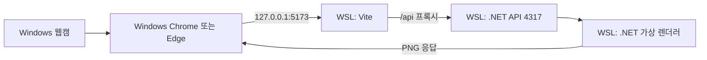

# WSL 개발·가상 출력·실물 전환 가이드

작성일: 2026-08-31. 현재는 설계 문서만 있으며 아래 앱 실행/빌드 명령은 Claude Code가 구현할 계약이다. 이 문서 작업에서는 SDK 설치, 배포판 업그레이드, 앱 구현을 하지 않았다.

실제 Claude 실행은 `TASKS.md`의 번호형 작업을 따른다. 환경/실행 준비는 01, 개발 인증/프록시는 02, Windows 패키징은 13이다. 이 가이드 전체를 매번 읽고 모든 작업을 함께 실행하지 않는다.

## 1. 정한 방식

**코드 작성과 가상 출력 서버는 WSL, 화면과 실제 웹캠은 Windows 브라우저**에서 실행한다. .NET의 가상 렌더링은 Linux에서도 돌아가게 만들고, 나중에 GDI 실물 인쇄를 할 때만 출력 호스트를 Windows에서 실행한다. 개발 환경을 Windows로 옮길 필요는 없다.

| 작업 | 실행 장소 |
| --- | --- |
| Claude Code, Git, Node/npm, Vite | WSL의 `/home/msilot/ysfourcut` |
| .NET API와 가상 영수증 렌더 worker | 같은 WSL, Linux용 .NET 10 |
| 화면 조작과 실제 웹캠 촬영 | Windows Chrome/Edge |
| 자동 API/이미지/샘플 카메라 테스트 | WSL. 실제 웹캠 시험과 별도 기록 |
| 후속 AHAPOS GDI 실물 출력 | Windows의 .NET 호스트/worker와 프린터 드라이버 |



카메라는 브라우저의 `getUserMedia()`로 읽는다. Windows 브라우저가 Windows 웹캠에 접근하므로 웹캠 USB를 WSL에 전달하거나 Linux 카메라 드라이버를 설치할 필요가 없다. 권한 허용과 카메라 동작은 실제 Windows 브라우저에서 확인한다. [카메라 API](https://developer.mozilla.org/en-US/docs/Web/API/MediaDevices/getUserMedia)

## 2. 현재 환경에서 확인한 사실

| 항목 | 확인 결과 |
| --- | --- |
| 배포판 | WSL의 Fedora Linux 42, x86_64 |
| 프로젝트 | `/home/msilot/ysfourcut`, Linux 파일시스템에 위치 |
| Node/npm | nvm의 Node `v25.2.1`, npm `11.6.2` |
| Linux .NET | PATH, 표준 경로, 일반 사용자 설치 경로와 RPM 조회에서 SDK/런타임을 찾지 못함. 설치 위치가 별도라면 재확인 |
| 그래픽 관련 OS 라이브러리 | fontconfig `2.16.0`, freetype `2.13.3` 설치 확인. Skia 실행 자체는 아직 미검증 |
| Windows → WSL 연결 | WSL의 `127.0.0.1` 임시 HTTP 서버에 Windows에서 접속하여 HTTP 200/예상 본문 확인. 시험 서버 종료 완료 |
| 앱 실행 | 아직 앱·SDK가 없으므로 Vite/.NET/PNG 생성/웹캠 연동은 실행하지 않음 |

현재 .NET 공식 Fedora 지원표는 Fedora 43/44를 열거한다. Fedora 42에서의 실행 가능성과 공식 지원을 혼동하지 않는다. 재현 가능한 개발 환경에는 지원 중인 Fedora WSL 버전을 권장한다. 이 문서 작성에서는 배포판을 변경하지 않았다. [Microsoft Fedora 설치·지원표](https://learn.microsoft.com/en-us/dotnet/core/install/linux-fedora)

Node 25 대신 **Node 24 LTS의 지원 패치**를 이 프로젝트의 기본 도구로 선택하고 `.nvmrc`에 고정한다. 현재 Node 25 설치나 다른 프로젝트의 기본 nvm 설정을 지우거나 바꾸지 않는다. [Node 공식 지원 일정](https://github.com/nodejs/Release#release-schedule)

## 3. WSL에서 준비할 것

1. 기존 파일과 설치된 도구를 다시 확인한다. 소스는 지금의 Linux 경로에 둔다. Windows와 WSL이 같은 `node_modules`, `bin`, `obj`를 동시에 재사용하지 않게 한다.
2. 지원 중인 Fedora에서 공식 배포판 패키지로 Linux용 **.NET 10 SDK**를 설치하는 것이 우선이다. 공식 설치 명령은 `sudo dnf install dotnet-sdk-10.0`이며, 현재 Fedora 42에서 같은 명령이 성공하거나 공식 지원된다고 가정하지 않는다.
3. 배포판을 유지해야 한다면 공식 수동/사용자 설치 경로와 OS 의존성을 검토하고 실행을 확인한다. 사용자 설치가 Fedora 42를 공식 지원 환경으로 바꿔 주지는 않는다. 서로 다른 배포처의 .NET 패키지를 섞지 않는다. 배포판 업그레이드/교체를 이 앱 구현에 끼워서 자동 실행하지 않는다.
4. 프로젝트에서 Node 24 LTS를 사용하고 실제 패치와 npm lockfile을 고정한다. 새 버전 설치가 필요해도 다른 프로젝트의 nvm 기본값은 보존한다.
5. `dotnet --info`, 패키지 복원, Linux Skia 로드, 작은 PNG 생성까지 확인한다. fontconfig/freetype 존재만으로 전체 네이티브 의존성이 준비됐다고 판단하지 않는다.

설치 상세는 [공식 Fedora 안내](https://learn.microsoft.com/en-us/dotnet/core/install/linux-fedora)와 [공식 Linux 수동 설치 안내](https://learn.microsoft.com/en-us/dotnet/core/install/linux-scripted-manual)를 따른다. 이 문서의 명령을 실행했다고 보고하지 않는다.

## 4. 개발 명령과 접속 계약

아래는 **앱과 패키지 설정을 구현한 뒤** WSL 터미널에서 사용할 명령이다. 현재는 `package.json`과 .NET 프로젝트가 없어 실행할 수 없다.

```bash
cd /home/msilot/ysfourcut
nvm use
npm ci
npm run dev
```

`npm run dev`가 Vite와 실제 Linux .NET 호스트를 함께 시작하고, 호스트 준비 실패를 명확히 표시해야 한다. .NET 없이 프런트만 열린 것을 전체 앱 실행 성공으로 처리하지 않는다. 종료 시 두 서버와 렌더 worker를 함께 정리한다.

| 용도 | 주소·규칙 |
| --- | --- |
| 개발 화면 | Windows 브라우저의 `http://127.0.0.1:5173` |
| Vite | WSL의 `127.0.0.1:5173`, `strictPort=true` |
| .NET | WSL의 `127.0.0.1:4317`, `printerMode=virtual` |
| 웹 API 호출 | `/api/...` 상대 경로만 사용 |
| Vite 프록시 | `/api` 전체를 `http://127.0.0.1:4317`로 전달. bootstrap/작업/PNG/정리 모두 포함 |
| 빌드 후 WSL 통합 시험 | .NET이 웹 빌드까지 제공하는 `http://127.0.0.1:4317` 접속. Vite 불필요 |

개발 프록시는 요청 Host를 내부 API 주소로 바꿀 수 있지만 **Origin은 실제 개발 화면 주소를 유지**한다. .NET은 개발 환경에서만 정확한 `http://127.0.0.1:5173` Origin을 허용한다. Origin을 임의로 덮어써 보안 검사를 통과시키거나 CORS `*`를 사용하지 않는다. 프록시를 쓰므로 기본 흐름에 브라우저의 교차 출처 API 호출은 필요 없다. [Vite 프록시 문서](https://vite.dev/config/server-options#server-proxy)

브라우저가 받는 세션 쿠키는 Domain을 생략하고 Path=/, HttpOnly, SameSite=Strict로 설정한다. 작업/PNG 요청의 세션과 전용 헤더도 유지한다. 개발 실행기는 기존 일회용 bootstrap 코드를 URL fragment로 Windows 브라우저에 전달하고, 코드나 전체 인증 URL을 로그/히스토리에 출력하지 않는다. WSL에서 Linux GUI 브라우저가 자동 실행되리라 가정하지 않는다. Windows 브라우저 열기 기능이 없으면 안전한 일회용 페어링 화면을 구현하며 인증 자체를 끄지 않는다.

주소는 `127.0.0.1`로 통일한다. `localhost`와 섞어서 쿠키/Origin 문제를 만들지 않는다. Windows에서 WSL 서버에 localhost로 접속하는 것은 WSL의 지원 기능이며, 현재 PC에서도 임시 서버로 확인했다. 반대 방향인 **WSL → Windows 서비스**는 기본 NAT에서 별도 조건이 있으므로 같은 것으로 취급하지 않는다. [Microsoft WSL 네트워크 안내](https://learn.microsoft.com/en-us/windows/wsl/networking)

연결 실패 시 WSL 안의 서버 준비 상태, Windows에서의 루프백 접속, 포트 충돌, WSL 네트워크 설정, Host/Origin 순으로 확인한다. `0.0.0.0` 공개, 방화벽 해제, portproxy 추가, WSL 전체 종료를 자동 해결책으로 쓰지 않는다. 기본 NAT에서도 이 개발 구조를 사용할 수 있으며 mirrored 모드 전환을 필수 조건으로 넣지 않는다.

## 5. .NET 구현 시 Linux를 막지 않을 조건

- 공통 호스트는 `net10.0`으로 만들고 `net10.0-windows`, WPF, WinForms, `System.Drawing.Common`을 가상 렌더러의 필수 의존성으로 넣지 않는다. 기존 CrossEscPos Skia 모듈과 Linux 네이티브 자산을 사용한다.
- Windows 프린터 열거/GDI/P/Invoke는 후속 어댑터 내부로 한정한다. 시작 시 `OperatingSystem.IsWindows()` 등을 확인하고 Linux에서 physical 선택은 `PLATFORM_UNSUPPORTED`로 거부한다. 가상 모드에서 Windows DLL을 로드하지 않는다.
- worker 실행 경로에 `.exe`나 `cmd.exe`를 고정하지 않는다. `dotnet <host.dll>` 개발 실행과 플랫폼별 apphost 실행을 구분해 자식 프로세스를 시작한다. 임의 셸 문자열 결합 없이 인수를 전달한다.
- Linux 프로필은 `$XDG_CONFIG_HOME/YSFourcut` 또는 `~/.config/YSFourcut`, 사진 없는 작업 기록은 `$XDG_STATE_HOME/YSFourcut` 또는 `~/.local/state/YSFourcut`에 둔다. Windows는 기존 `%LOCALAPPDATA%/YSFourcut`을 사용한다. 사진 캐시 정책은 양쪽 모두 메모리 한정이다.
- 대소문자 구분, 경로 구분자, 파일 잠금/원자적 쓰기, 부모 종료 시 worker 정리를 Linux에서도 확인한다. Windows 성공 결과만으로 이를 대체하지 않는다.
- API/가상 PNG 검수는 실제 Linux 호스트를 띄운다. WSL의 자동 브라우저 시험은 샘플 카메라를 쓸 수 있지만, Windows 실물 웹캠 시험과 구분한다.

## 6. 프린터가 생긴 뒤

소스 개발은 계속 WSL에서 한다. 후속 GDI 어댑터와 웹 빌드를 포함하여 Windows용 배포 폴더를 만들고 **Windows에서 실행**한다.

1. WSL에서 웹을 빌드하고 .NET을 `win-x64`로 publish한다. 처음에는 일반 self-contained 배포로 하고 Native AOT/ReadyToRun을 추가하지 않는다. 아래 명령의 파일명은 생성할 프로젝트 계약이다.

   ```bash
   dotnet publish apps/print-host/YsFourcut.Host.csproj \
     -c Release -r win-x64 --self-contained true \
     -p:PublishAot=false -p:PublishReadyToRun=false \
     -o dist/win-x64
   ```

2. `npm run package:win`은 웹 빌드를 `wwwroot`에 포함하고 Windows용 Skia 네이티브 파일까지 점검하는 래퍼로 구현한다. `win-x64` publish 성공은 Windows 실행 검증과 다르다. Linux 전용 패키지의 RID 경고/오류를 무시하지 않는다. [Microsoft .NET 배포 안내](https://learn.microsoft.com/en-us/dotnet/core/deploying/)
3. 완성된 배포 폴더를 Windows 로컬 경로에 복사하여 실행한다. WSL 소스/빌드 디렉터리를 Windows의 별도 빌드 작업으로 덮어쓰지 않는다.
4. 먼저 Windows virtual 모드에서 PNG와 한글을 확인한다. 그다음 실제 AHAPOS 모델·큐·드라이버·용지 길이를 확인하고 작은 패턴으로 physical을 검수한다.
5. Windows 호스트가 웹까지 제공하게 한다. Windows 브라우저 → Windows .NET → AHAPOS 구조가 되므로 WSL Vite에서 Windows API로 프록시하는 별도 네트워크 설정이 필요 없다. 같은 호스트의 4317 포트를 쓰는 WSL 가상 호스트는 해당 앱 프로세스만 종료한 뒤 전환한다.

현재 개발 검수는 **WSL 가상 출력 + Windows 브라우저 화면/카메라 시험**이다. Windows 배포물 생성·Windows 가상 실행·AHAPOS 실물 인쇄는 각각 별도로 결과를 보고한다. Windows 실행 검증 전에는 Windows 배포 버전 완료로 표시하지 않는다. WSL 개발을 위해 실물 검수를 먼저 요구하지 않는다.
